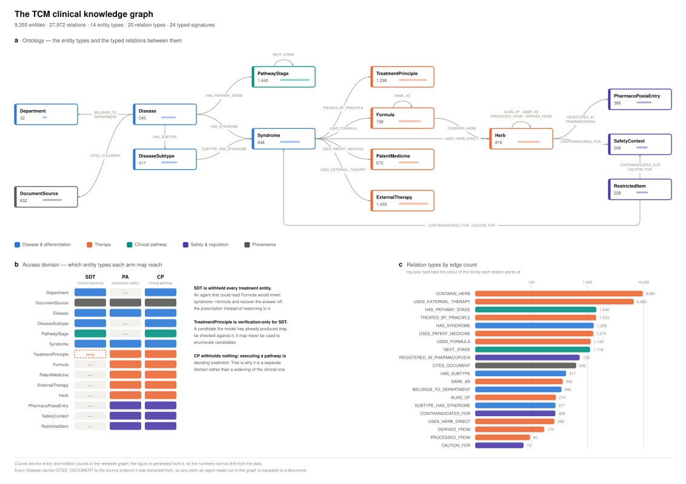

# TCM-KG Agent Harness

A frozen agent harness for measuring what a Traditional Chinese Medicine
clinical knowledge graph adds to frontier LLMs, across two complementary
benchmarks:

- **TCMEval-SDT** — a *four-task* syndrome-differentiation benchmark
  (knowledge-enhanced *clinical reasoning*), scored by the benchmark's own
  weighted rules
- **TCMEval-PA** — 328 multiple-choice prescription-audit items across 19 rule
  families (knowledge-grounded *rule and tool reasoning*)

A third corpus, **TCM-SD** (43k EHR records over 148 syndrome labels, plus a
1,027-entry syndrome knowledge base), loads through the same interface for
scale-up work.

The same framework serves both. Only `model.generate()` differs between arms,
and a `framework_hash` proves it.

```
                         TCMEval
              ┌─────────────┴─────────────┐
         TCMEval-SDT                 TCMEval-PA
              │                           │
      Clinical Parser              Rule Classifier
              │                           │
              └────────────┬──────────────┘
                           ▼
                   Frozen Agent Runtime  (M0 · M1 · M2 · M3 · M4)
                           │
              ┌────────────┴────────────┐
              ▼                         ▼
    Clinical Reasoning Domain   Prescription Safety Domain
    Department · Disease        Disease · Syndrome · Formula
    DiseaseSubtype · Syndrome   Herb · PatentMedicine
    PathwayStage · DocSource    SafetyContext · RestrictedItem
                                PharmacoPoeiaEntry · DocSource
              │                         │
              └────────────┬────────────┘
                           ▼
              8 KG tools + 5 deterministic checkers
                           │
              ┌────────────┴────────────┐
              ▼                         ▼
        Reasoning Agent            Rule Engine
              └────────────┬────────────┘
                           ▼
                  Verification · Trace · Score
```

---

## The benchmarks, as released

**TCMEval-SDT is four tasks, not one**, and its `scripts/evaluate.py` fixes the
scoring:

| task | field | form | weight |
|---|---|---|---|
| 1 | `Clinical Information` | `;`-separated findings | 0.2 |
| 2 | `Answers of TCM Pathogenesis` | letters, 10 options, often multi | 0.3 |
| 3 | `Answers of TCM Syndrome` | letters, 10 options, often multi | 0.4 |
| 4 | `Explanatory Summary` + `Syndrome Differentiation` | free text, ROUGE-L | 0.1 |

Three consequences the harness is built around:

- **Pathogenesis and syndrome are multiple choice.** The options arrive as
  *named* pathogeneses and syndromes, so the agent can look each candidate up
  in the graph rather than guess a name from the case text. That fits this
  graph far better than free-form naming.
- **The held-out splits ship blank answer columns.** Gold labels for
  validation and test live only in `Results/*.txt`, in the `@`-separated
  submission format. The loader merges them by record ID, so pointing at the
  test split yields a scorable dataset instead of silently scoring against
  empty strings.
- **Scoring follows the benchmark, quirks included.** `tcm_eval/official_sdt.py`
  reproduces the official rules and is checked against the vendored original on
  perfect, random and empty submissions (`tests/test_official_sdt.py`). Two
  quirks matter and are preserved: a wrong option **dilutes rather than
  forfeits** credit (`correct / (|gold| + n_wrong)`, so selecting all ten
  scores `|gold|/10`, not zero), and because the evaluator never strips line
  terminators an **empty explanation scores ~0.009 rather than 0**. `submit`
  writes the official format so a run can be scored by the benchmark's own
  evaluator rather than only by this harness's arithmetic.

**TCMEval-PA** is 328 items — 297 single-choice, 31 multiple-choice — each
tagged with one of 19 `Rule_ID` families. The distribution decides how much the
graph could possibly help; see below.

## What the knowledge graph actually is

9,350 nodes and 27,972 edges over **14 entity types** and **20 relation
types**, built from national TCM clinical protocols, clinical pathways and the
2025 Chinese Pharmacopoeia. Verified against the declared ontology on every
load (`validate_graph`), and it matches exactly.

| layer | entities |
|---|---|
| clinical organisation | Department (32) |
| disease | Disease (345), DiseaseSubtype (417) |
| differentiation | Syndrome (648), TreatmentPrinciple (1,296) |
| therapy | Formula (798), Herb (816), PatentMedicine (672), ExternalTherapy (1,432) |
| pathway | PathwayStage (1,440) |
| safety | SafetyContext (208), RestrictedItem (228) |
| regulation | PharmacoPoeiaEntry (386) |
| provenance | DocumentSource (632) |



The figure above is generated from the graph and the schema by
`scripts/figure_kg.py`, so its counts cannot drift from the data; panel **b**
is the access-domain table described under *Access domains* below. See
`docs/figures/README.md` for the caption and how to raster it.

**There is no `Symptom` node and no `Pathogenesis` node, and none was added.**
Symptoms, tongue, pulse and pathogenesis are *transient clinical features* the
model produces at run time. Pathogenesis in particular is treated as a latent
reasoning variable, never as something to look up — which is what makes any
SDT pathogenesis gain attributable to the graph narrowing the reasoning space
rather than to retrieving the answer.

### The finding that shapes the retrieval design

The graph stores no document bodies, so "semantic retrieval over
DocumentSource" cannot mean retrieving passages. But **312 of 648 Syndrome
nodes carry the protocol's verbatim definition sentence** in
`first_mention.sentence`:

> `1.心虚胆怯证：心悸，善惊易恐，坐卧不安，如恐人将捕之，多梦易醒，恶闻声响，食少纳呆。`

That sentence lists main symptoms, tongue and pulse. It is the symptom→syndrome
mapping, latent in the graph rather than absent from it. Retrieval is therefore
built over a **virtual document per entity**, assembled from names, aliases,
the definition sentence, type-specific structured fields, and the evidence
sentences of incident edges — which is also where preparation requirements
(先煎/后下/烊化) actually live.

---

## Design decisions that carry the experiment

### 1. Access domains, enforced at the tool boundary

An SDT agent that could see `Formula` would invert the syndrome→treatment
mapping and recover the answer from the prescription — not the ability SDT
means to measure. So the medication tools are not merely discouraged; they are
**unreachable**, and an attempt is recorded in the trace as an invalid call.

`TreatmentPrinciple` is exposed to SDT for *verification only*: a candidate the
model already produced may be checked against it, but it can never be used to
enumerate candidates.

### 2. No query language

Exposing `run_cypher` would make Cypher-writing skill a per-model confound in
what is meant to be a knowledge comparison. Every model sees the same tool list
for its access domain, with byte-identical descriptions — 4 on SDT, 7 on PA,
10 on the pathway task — and a test asserts no tool description mentions a
query language. The registry holds 16, but the 6 verification-phase tools are
the M4 pass's, not the agent's.

### 2b. Statistics chosen from the data

SDT's primary metric is the benchmark's own weighted composite — continuous on
[0, 1]. Testing it with McNemar, as an earlier version did, discards the
magnitude of every paired difference and tests a hypothesis the metric does not
express. The harness now picks the test from the observed values: exact
McNemar for genuinely binary outcomes (PA accuracy), paired bootstrap with a
95% CI for continuous ones, with Wilcoxon signed-rank reported beside it.

Multiplicity is controlled **within prespecified hypothesis families** — SDT is
the effectiveness family, PA the safety family — and the report names the
family and its size in the table caption, so the correction and the prose
cannot drift apart.

### 3. Coverage is explicit — silence is not absence

Every tool returns a coverage verdict:

| verdict | meaning |
|---|---|
| `supported` | the graph encodes this, and the answer is grounded in it |
| `partial` | the graph encodes part of it; the gap is named in `caveats` |
| `empty` | the graph encodes this *class* of fact and has none for this query |
| `not_covered` | the graph does not encode this class of fact at all |

The distinction between `empty` and `not_covered` is the whole point. A
prescription-audit system that reports "no contraindication found" when it
never had a contraindication table produces a false negative, and false
negatives in drug safety are the dangerous kind.

### 4. Honest gaps, measured not asserted

`python -m runner.benchmark_runner coverage` audits the 19 PA rule families
against what the graph holds, then projects that onto the released item
distribution. The verdict: **3 grounded, 6 partial, 10 not grounded** — and
weighted by how many questions each family actually carries:

| graph verdict | PA items | share |
|---|---|---|
| not grounded | 166 | 50.6% |
| partial | 113 | 34.5% |
| grounded | 49 | 14.9% |

**Half the released PA set is in families this graph cannot ground at all**, and
the single largest family — A-003, single-herb dosage, 87 items (26.5%) — is
one of them. Any KG effect on PA is bounded to roughly the other half, which is
why the report splits PA accuracy by verdict instead of pooling it. Concretely,
this graph contains

- **no dosage field** — `用法用量` appears 0 times, so `check_dose` returns
  `NOT_COVERED` by construction;
- **no 十八反/十九畏 table** — 0 mentions, so `check_combination` cannot rule
  on incompatibility;
- **no 君臣佐使 role annotation** (0 mentions), no prescription-validity
  metadata (0), no controlled-substance schedule (0);
- **no PatentMedicine composition** (0 of 672), so component-level duplication
  involving a proprietary medicine is undecidable here.

A worked example of why this matters: **半夏 and 附子 are a genuine 十八反
incompatible pair, and they co-occur in three formulas in this graph.** A tool
that reported co-occurrence as evidence of compatibility would confidently
endorse a classical contraindication. `check_combination` therefore returns
`not_covered`, labels co-occurrence as weak compatibility evidence only, and
says the incompatibility table is absent. There is a test for exactly this.

### 3a. Nothing routes on the answer key

PA's deterministic verification picks its checker from the **model's own
declared `rule_category`**, never from the benchmark's `rule_id` annotation.
Reading the annotation would tell an M4 model which safety rule the question
was about — dose, or contraindication, or incompatibility — which is a large
part of the work, and no other arm receives it. A model that miscategorises its
own question gets routed to the wrong checker, exactly as it would in
deployment. `rule_id` survives only in scoring, where it belongs.

### 3b. Verification is deterministic, and checks the whole answer

M4 re-runs rule-engine checks over the answer the model just gave, then gives
the model one revision turn. Two properties matter:

- **Every selected option is checked.** 27 of the 50 SDT test cases have more
  than one correct syndrome; verifying only the first would leave most of a
  multi-select answer unchecked and make the signal depend on answer order.
- **PA verification is real.** Each rule family maps to the deterministic
  checkers that can adjudicate it — `N-003` to the decoction checker with the
  *claimed* preparation passed through, `A-008` to duplicate detection, and so
  on. For the majority of PA items no checker applies, and there M4 falls back
  to the coverage audit: "the graph cannot speak to this — did you claim it
  could?" That is the honest verification for a rule with no data behind it.
- **The verifier is independent of the claim-maker.** SDT verification matches
  a candidate syndrome against findings derived from the **raw case text**, not
  against the findings the model itself chose to report. Verifying a syndrome
  against evidence the claimant curated is self-confirmation: a model that
  decided on 肝郁气滞 will have listed 胸胁胀痛 and 脉弦, and the verifier would
  duly agree.

### 4b. The SDT leakage check

The KG conditions hand the model a lookup over the ten named options, which is
only legitimate if the graph recognises distractors and gold answers at the
same rate. Measured across all three splits:

| split | options in graph | **gold** options in graph |
|---|---|---|
| Test | 161/500 (32%) | 25/81 (31%) |
| Validation | 183/500 (37%) | 25/77 (32%) |
| Train | 689/2000 (34%) | 115/335 (34%) |

The rates match, so a model cannot score by picking whichever option the graph
happens to know. Had gold coverage been materially higher, the KG arms would
have been measuring answer leakage rather than reasoning and the option-lookup
tool would have had to be withdrawn. A regression test enforces the gap stays
under 10 points.

**Task-2 options are never looked up at all.** Pathogenesis is not a graph
entity, which is what makes a task-2 gain interesting — it can only come from
the graph constraining the reasoning space. An earlier version nevertheless ran
the pathogenesis options through a syndrome lookup (a flag meant to prevent it
did not), so "which options does the graph recognise" became a signal
correlated with the answer. That path is gone, and because an M3 agent could
still type an option into the search tool of its own accord, the prompt
forbids it and `pathogenesis_probe_rate` measures how often it happens anyway.
Reporting the rate is better science than assuming it is zero.

### 5. Deterministic checks stay deterministic

`LLM = decides what to look up + integrates + explains`,
`KG = supplies facts`, `Rule engine = makes the decidable calls`.
`verify_tcm_decision` and the five `check_*` tools never call a model, so the
verification signal is identical across models and cannot itself become a
source of measured difference.

### 6. The framework hash

Everything a model could be advantaged by is hashed together — and so is what
the run was *measuring*:

```
framework_hash = sha256(prompts ‖ tools ‖ retrieval ‖ budgets ‖ decode ‖ limits
                        ‖ task ‖ domain ‖ kg_content ‖ dataset_content)
```

Beyond the framework hash, each run freezes a `manifest.json` recording the
KG content hash, dataset hash, **case list and its hash**, **model
fingerprints** (provider + model id + base URL + `extra_body`, so repointing a
model key is detectable), and **implementation hashes** of the tool, scorer,
retrieval and runtime modules — because a framework hash over tool
*descriptions* does not notice a rewritten `check_dose` body. `score` and
`report` read that frozen manifest rather than recomputing from the config as
it reads today, and report any code drift since generation.

The last four hash inputs matter. Without `task` and `domain` an SDT run and a PA run
hashed **identically**, certifying as comparable two runs that read different
sub-graphs and answered different questions. Without the content hashes, an
edited graph or a swapped dataset file left the hash unchanged. The graph hash
is semantic — computed over node and edge contents, not file bytes — so the
JSON and GraphML exports of one graph agree while any edit to a relation
changes it. The retrieval index caches on it too; keying on node *count*, as an
earlier version did, meant a thousand edited relations silently reused a stale
index.

### 7. Contamination: the confound pairing cannot remove

Pre-training contamination is **shared** — every arm of a model memorised the
same records, so the paired difference cancels it. Graph contamination is not:
only M2/M3/M4 read the graph, so a case whose answer sits in the graph's
evidence text hands those arms the answer key, and the difference lands in the
contrast reported as the KG effect.

`benchmark_runner contaminate` audits the 16,052 passages a KG arm can reach at
four levels — verbatim gold, character 5-gram Jaccard, containment, cited
source — deterministically and with no embedding model, because an audit whose
purpose is to be checkable should not contain an uncontrolled variable.

| benchmark | cases | clean | possible | likely |
|---|---|---|---|---|
| SDT | 50 | **70.0%** | 12.0% | 18.0% |
| PA | 328 | **89.0%** | 5.8% | 5.2% |
| CP | 500 | 0.0% | 0.0% | 100% |

An earlier version reported SDT 100.0% and PA 99.4%. Those were wrong: the
corpus indexed about half the reachable text (missing 99.8% of PathwayStage,
100% of PharmacoPoeiaEntry), containment ran one way so a case that was an
*excerpt* of a graph passage scored 0.315, and multi-select gold was joined
before matching so two separately-leaked options reported clean. All three are
fixed and the corpus is now built from `virtual_document` — the same text the
retriever indexes, so the audit cannot fall behind retrieval.

**The detector is validated, which is what makes a null result mean anything.**
TCM-CP is contaminated by construction and the audit says so at 100%. Planted
copies, excerpts, leaked multi-select options and six realistic rewrite modes
are all caught; unrelated text stays far below threshold.

`score` attaches the stratum and the report recomputes the KG contrasts on the
clean subset. Say what it supports: a gain persisting there is **less
consistent with detectable lexical or provenance overlap** — not a proof that
no contamination exists. `clean` means this audit found nothing. The audit is
hash-locked to the graph, dataset, gold and case set it was computed against,
and `score` refuses a stale one.

### 8. Dataset identity

`case_id` is the primary key of the gold lookup, the resume key and the paired
analysis — three dicts, so a repeat means last-write-wins in all three. A
TCM-CP build shipped 825 rows over 331 identifiers because CP4 ids named the
syndrome and not the disease; one id spanned 19 diseases whose gold letters ran
A through F. A model answering one disease was scored against another's key,
and whether a run had been resumed changed the score.

The builder now validates before writing and refuses on any violation: unique
non-blank ids, gold inside the options, two real distractors, no two options
carrying the same answer, no answer echoed in the question under punctuation
and width normalisation. `load_dataset` imposes unique keys for every benchmark
and records what it had to rename — which found TCM-SD's released dev split
shipping 178 repeated `user_id`s, a third-party file disambiguated
deterministically rather than refused.

### 9. The run signature

The framework hash has to stay **equal** across models — that is what makes
"every arm saw the same scaffold" a checkable claim. The same blindness means
traces from two model snapshots, or from before and after a tool rewrite, carry
one hash and pool silently. So every trace also carries a `run_signature`
covering what the framework hash omits:

```
run_signature = sha256(framework_hash ‖ kg ‖ dataset ‖ model_fingerprint
                       ‖ case_set ‖ tool/scorer/retrieval/runtime source)
```

Condition is deliberately excluded: conditions are the independent variable and
have to stay poolable. Because it lives on the trace, the check survives a
missing or stale manifest.

- **Resume** matches on the signature. Resuming on the framework hash kept
  exactly the traces a resume exists to regenerate.
- **`run` never overwrites** a manifest describing a different experiment — it
  was the only record of what the traces beside it came from. `--new-run`
  archives it instead.
- **`score` fails closed.** Mixed framework hashes, mixed run signatures,
  traces that do not match the manifest, a changed KG or dataset, or changed
  tool/retrieval/runtime code all stop the run. A changed *scorer* stays a
  note — re-scoring recorded traces with a fixed scorer is the whole point of
  separating generation from scoring. `--allow-drift` overrides, and the drift
  is written into `scored_manifest` and printed as a banner at the top of the
  report, so a forced number cannot later pass as a clean one.

**The design signature** sits one level up. The run signature omits the
condition on purpose, which leaves `conditions`, `samples`, `limit` and the
sampling rule in no fingerprint at all: narrow a seven-arm config to `[M0, M1]`
and the M2–M4 traces still matched, so the manifest described a two-arm
experiment beside a seven-arm trace file. It covers both levels, is stamped on
every trace, and gates resume.

Every run writes its `manifest.json` before generation starts, so an
interrupted run still records what it was doing. The report reproduces one
provenance block **per dataset**: keeping only the first config's block made a
three-dataset report attest that the PA and CP numbers came from the SDT run.

---

## What was borrowed from the DeepSeek harness

The [dsh-eval](https://github.com/hccccc01333/dsh-eval) design contributed four
things:

| borrowed | here |
|---|---|
| declarative `benchmark.yaml` | `configs/experiment.*.yaml` — one file fixes models, arms, budgets, decode |
| trace-based metrics | metrics are derived *from* persisted traces, never accumulated during a run, so new metrics apply to old runs |
| keyless replay | `--replay` re-runs entirely from the request cache with no API key; the cache key hashes the full message list, so an edited prompt necessarily misses and replay can never misrepresent a prompt that no longer exists |
| paired A/B compare | `compare` reports win/lose/tie with signed deltas over matched cases |
| scripted grading vs LLM judge as separate layers | deterministic scorers and `SDTJudge` are independent; judge failure degrades to *unscored*, never to a silent zero |

Plus the split that makes iteration affordable: **generation and scoring are
separate phases**, so fixing a scorer costs nothing — no token is re-billed
across 300 cases × 5 models × 5 conditions.

---

## Experimental arms

| arm | structured prompt | KG evidence | model-chosen tools | verification | model calls |
|---|---|---|---|---|---|
| **M0** Base LLM | – | – | – | – | 1 |
| **M1** Structured | ✓ | – | – | – | 1 |
| **M2** KG-RAG | ✓ | static, deterministic | – | – | 1 |
| **M2C** Iterative control | ✓ | **same static KG as M2** | – | – | = M3 (per case) |
| **M3** KG-Agent | ✓ | agentic | ✓ | – | multi |
| **M3C** Sham-revision control | ✓ | agentic | ✓ | **no evidence** | = M4 (per case) |
| **M4** KG-Agent + Verify | ✓ | agentic | ✓ | ✓ | multi |

**The controls exist because M3 and M4 spend more test-time compute than the
arms they are compared against.** Without them, `M2→M3` confounds "the agent
used the graph" with "the model got more turns to think", and `M3→M4`
confounds "verification helped" with "being asked to look again helped".

Each control changes exactly one thing from the arm it is matched to:

- **M2C** receives the *same static KG block M2 receives* and M3's turn budget,
  with no tool access. So `M2C→M3` isolates adaptive retrieval alone. (An
  earlier version built M2C with no graph evidence at all, which moved four
  variables together and could not isolate agency.)
  The match is **per case**: M2C is generated alongside its M3 twin and pinned
  to the calls that twin actually spent, because a mean can match while no
  individual pair does.
- **M3C** takes M4's extra revision turn with no verification evidence in it,
  so `M3C→M4` isolates the verification content.

Both are **turn-matched, not compute-matched**. Model calls are equal per case
by construction; tokens are not, and should not be — an agent's tool results
enter its later prompts, so M3 carries up to 23.5% more tokens than M2C at the
same turn count, and M4's verification report is longer than M3C's sham one.
Forcing tokens equal would delete the evidence the intervention *consists of*,
so the report gives the call ratio and the token ratio side by side and the
claim stays the one that is true.

**M3, M3C and M4 share one agent phase.** The reasoning loop runs once per
case and the branches fork after the first answer, so M3C and M4 differ *only*
in the verification report — not in whatever the model happened to do
differently on an independent run. Provider seed support is inconsistent, so
this cannot be left to a seed. Both revision turns re-receive the full case,
question and option list: told only that option C is unsupported, a model with
no view of the alternatives cannot choose among them, and that is an amnesia
effect rather than a verification effect.

**Agents cannot call the verifier themselves.** Every tool carries a `phase`
(`agent`, `verification`, `both`), and the whole verification surface —
`verify_tcm_decision` *and* the five deterministic PA checkers — is
verification-phase. Withholding only `verify_tcm_decision` left `check_dose`
and its four siblings callable by the agent, so M3 was an optionally
self-checking arm and `M3→M4` contrasted optional with mandatory verification
rather than absent with present.

**Tool calls record who made them.** A `ToolStep` carries its phase, so
`tool_selection_accuracy`, `coverage_honesty` and `pathogenesis_probe_rate` see
only the calls the model chose. The M4 verifier calls the right checker for the
item by construction; counting those would have credited M4 with tool-use skill
for a choice it never made. The behaviour table reports `agent calls` and
`verifier calls` in separate columns.

**M4 always takes its revision turn**, including on the items no deterministic
checker adjudicates — it emits an explicit `not_applicable` report instead of
returning early. Returning early spent one model call fewer than M3C on exactly
those cases, so the mean stayed close while the contrast over that subset was a
second-turn effect. Parity is now checked *per case*; a break flags both arms,
drops the pair from the contrast and is counted in the parity table. Because
the M4 arm now holds two treatments under one label, the report splits the
`M3C→M4` gain by verification stratum (`deterministic` / `audit_only` /
`not_applicable`) — a gain concentrated in the last is a second-turn effect and
is reported as one.

The interpretable contrasts are:

```
Δ_structure     = M1  − M0     prompt scaffold only
Δ_retrieval     = M2  − M1     static KG evidence
Δ_agency        = M3  − M2C    adaptive retrieval, KG and turns held constant
Δ_verification  = M4  − M3C    verification content, trajectory and turns held constant
```

`M0→M3` is reported too, but labelled the **whole-scaffold effect** — it
contains prompt structure, retrieval and agency together and is not a KG-only
result. A compute-parity table reports realised calls and tokens per control
pair *and the number of per-case parity breaks*, so the matching claim is
evidenced rather than asserted — means can agree while individual pairs do not.

---

## Providers

| key | adapter | notes |
|---|---|---|
| `deepseek`, `glm`, `gpt` | `openai_compat` | first-party OpenAI-shaped endpoints |
| `gemini` | `gemini` | `generateContent`; sends the decode seed |
| `minimax` | `minimax` | see below |
| `poe` | `poe` | gateway; see below |
| `echo` | `echo` | offline, used by the test suite |

**MiniMax** gets its own adapter because it reports API errors with **HTTP
200** and a non-zero `base_resp.status_code`. Through the generic client those
became successful *empty* answers, so a rate limit or a bad key would have
lowered MiniMax's answered rate for a reason that is not the model. It may also
report only `total_tokens`; that is recorded as-is rather than split into a
guessed prompt/completion ratio.

**Poe** is a gateway, and that costs reproducibility: `model_id` is a Poe *bot*
name, and a bot can be repointed at a different upstream snapshot without the
name changing, so the manifest cannot pin a snapshot the way a first-party
endpoint can. Every completion is marked `via_gateway`. Prefer a first-party
adapter where one exists, and disclose which models came through Poe. Sampling
controls are forwarded but not guaranteed — run `smoke` and trust its
seed-determinism column.

Before any real run:

```bash
python -m runner.benchmark_runner smoke              # every provider
python -m runner.benchmark_runner smoke --models minimax poe
```

## Quick start

```bash
pip install -e .            # PyYAML is the only runtime dependency

# 1. See what you have: ontology, access domains, tool contract
python -m runner.benchmark_runner inspect

# 2. Audit what the graph can honestly ground
python -m runner.benchmark_runner coverage        # -> docs/kg_coverage.md

# 3. Check your dataset binds before spending tokens
python -m runner.benchmark_runner inspect \
  --dataset data/sdt/Test_TCM_Data_v1.json --dataset-kind sdt

# 4. Run, score, report
export DEEPSEEK_API_KEY=... GEMINI_API_KEY=... OPENAI_API_KEY=...
python -m runner.benchmark_runner run   configs/experiment.sdt.yaml
python -m runner.benchmark_runner score configs/experiment.sdt.yaml
python -m runner.benchmark_runner judge configs/experiment.sdt.yaml   # task-4 quality
python -m runner.benchmark_runner report configs/experiment.sdt.yaml \
                                          configs/experiment.pa.yaml --out runs/report.md

# 5. Emit an official submission file and score it with the benchmark's own script
python -m runner.benchmark_runner submit configs/experiment.sdt.yaml \
                                          --model gpt --condition M3

# Offline: replay a recorded run with no API key
python -m runner.benchmark_runner run configs/experiment.sdt.yaml --replay
```

Runs are **resumable** — an interrupted run picks up from the recorded traces,
matching on `framework_hash`, and every request is cached on the way through.

```bash
python -m unittest discover -s tests -t .    # 102 tests, fully offline
```

The suite passes on a clean checkout with **no benchmark files present**: the
end-to-end tests run against committed synthetic fixtures written in the
released schemas, and the tests that need the real data skip themselves (17 of
102). CI runs it on 3.10 and 3.12 and also re-validates the graph against the
declared ontology.

---

## Research questions this is built to answer

**RQ1** How far apart are frontier models on SDT and PA with no external
knowledge? → M0/M1 across five models.

**RQ2** Does the graph help, and for whom? → `Δ(M0→M3)` per model, exact
McNemar per contrast, Holm–Bonferroni across the family.

**RQ3** Static KG-RAG or dynamic KG-Agent? → `Δ(M2→M3)`, with `Δ(M3→M4)`
separating out verification.

**RQ4** Does the gain differ between knowledge the graph encodes explicitly and
reasoning it only constrains? SDT's four tasks give an unusually clean ladder,
because they are scored separately under one composite:

| target | relationship to the graph |
|---|---|
| PA, grounded families (49 items) | **explicit** — the fact is an entity or an edge |
| PA, ungroundable families (166 items) | **none** — a control: any gain here is not knowledge injection |
| SDT task 3, syndrome | **partial** — syndromes are entities, symptoms are not; 32% of options in graph |
| SDT task 2, pathogenesis | **implicit** — not a graph entity at all |
| SDT task 1, clinical extraction | **none** — a second control, drawn from the case text alone |

The ungroundable PA families and SDT task 1 are the controls that make the rest
interpretable. If the KG arms improve there too, the effect is prompting rather
than knowledge. If accuracy on task 2 improves even though the graph never
encodes a pathogenesis, the mechanism is constraint of the reasoning space — a
stronger result than a lookup win.

**Compensation.** `compensation_table` reports Spearman ρ(base score, Δ) across
models. A negative ρ means the framework compensates weaker base models, which
would be the most useful practical finding available here.

---

## Fairness: what is frozen

Swapping a model changes exactly one thing — `model.generate()`. Frozen and
hashed: prompts, KG, tool set, tool descriptions, retrieval weights and top-k,
graph hops, context budget, tool-call budget, output schema, verifier,
temperature/top-p/seed, dataset, scorer.

The tool-calling protocol is a **uniform text protocol** for every model rather
than each provider's native function-calling API. Native tool calling differs
by provider in schema handling, parallel-call behaviour and error surfaces;
using one text protocol removes that as a confound, at the cost of not
measuring native tool-calling quality. That is the right trade for a knowledge
comparison, and it is a deliberate limitation worth stating in a methods
section.

Formal experiments should run through `benchmark_runner.py`, **not** inside
Codex or Claude Code. Those harnesses contribute their own system prompts and
agent loops, which would confound a five-model comparison. Use them to build,
debug and analyse; use the runner to measure.

---

## Three benchmarks, three different claims

| benchmark | what a gain there licenses |
|---|---|
| **TCMEval-SDT** | effectiveness: the graph improved clinical reasoning |
| **TCMEval-PA** | effectiveness: the graph reduced rule and knowledge errors — but only in the ~half of items whose rule family it can ground |
| **TCM-CP** | **capability only**: the agent can execute a staged pathway faithfully |

TCM-CP covers six subtask families — eligibility (CP1), stage identification
(CP2), stage actions (CP3), treatment planning across principle/formula/patent
medicine/external therapy (CP4), monitoring (CP5) and transition decisions
(CP6). Two things about its construction matter:

- **CP2 items are filtered for discriminability.** The first build was
  underdetermined: of 1,210 stage-identification items, *zero* could be
  resolved from what the vignette exposed, and the median item fit five stages
  of its own pathway — clinical pathway stages within one disease share their
  monitoring text almost verbatim. Items are now emitted only when every
  distractor differs observably from the gold stage, and vignettes carry a
  treatment-history line locating the patient in time. First stages are
  additionally capped at a 25% share, because "no prior treatment" identifies a
  first stage without any stage reasoning at all. The build reports what it
  dropped and why: 884 stages with no exit criteria, 222 first stages
  rebalanced, 46 not discriminable, 2 short of distractors.
- **Every subtask is checked for answer leakage**, in both directions — no
  emitted field may contain the gold string and no gold string may contain an
  emitted field. All nine subtasks are at 0%. The check found two real leaks:
  CP5 at 100% (the monitoring plan was printed in the vignette asking about it)
  and CP3 at 59.8%, which no review had flagged and which only a general
  per-field guard caught rather than a task-specific fix.
- **CP6 includes `insufficient_evidence`.** A pathway agent forced to always
  choose an action will choose one when the record supports none, which in a
  discharge decision is the dangerous direction. `unsafe_transition` counts any
  answer that moves a patient onward when the criteria are unmet *or*
  unassessed — including a mixed answer that contains both a safe and an
  unsafe option.

**CP4 treatment is disease-conditioned.** `Syndrome → Treatment` is a global
edge, but the clinical fact is ternary — *this disease's* guideline, for this
syndrome, recommends this treatment. Read globally, 补中益气汤 is "the formula
for 脾胃虚弱证" whether the pathway is 弱视, 吉兰巴雷综合征 or 糖尿病性胃轻瘫, and
the first global edge became the gold for all three. 54.45% of CP4 gold shared
no source document with the current `Disease → Syndrome` edge. **异病同治** is
real, so that is not proof of error — but the system could not show the
*pathway* recommends it. `treatments_of(syndrome, disease)` separates
`disease_specific` from `cross_disease_general`; ungrounded gold is down to
14.48% and the rest is labelled per item.

**The prespecified CP endpoint is the macro-average**, not pooled accuracy.
The nine subtasks run from 306 items (CP6) to 988 (CP3, CP5), so a pooled
number is 53% stage lookup and monitoring and 5.5% transition decision — a
model that reads stages well and moves patients on badly would read as a good
pathway executor. The report gives per-subtask rows plus the mean of the six
capability means, and tests it with a **hierarchical** macro bootstrap (resample
diseases within subtask, average the subtasks of a family, weight the six
families equally) so the interval describes the same quantity as the point
estimate. Two levels were not enough: passing the nine subtasks in flat
weighted CP4 at 4/9 where the table weighted it 1/6, and on a CP4-only
improvement the table said 0.167 while the test said 0.444. The sample is
drawn stratified by subtask for the same reason: a head-slice of 400 leaves CP6
with 28 items.

TCM-CP is built from the graph's own pathway layer (`scripts/build_tcm_cp.py`),
because no published TCM pathway benchmark exists. Its gold answers therefore
come from the same graph the KG arms consult, which makes it **circular by
construction** for those arms. It is a genuine and separately interesting
instrument — can an agent locate a patient in a pathway, name the actions due,
plan treatment, and respect exit criteria? — but a KG advantage on it is
expected and is *not* evidence for the effectiveness claims. The generated
report labels it, the config says so at the top, and its contrasts are never
pooled with SDT or PA.

The pathway work needed a fourth access domain rather than a widening of the
clinical one: executing a pathway means deciding on treatment, so
`clinical_pathway` withholds nothing. Opening treatment entities to SDT instead
would have let an SDT agent invert syndrome→formula and read off the answer.

## Repository layout

```
tcm_kg/       ontology · store · normalisation · hybrid retrieval
tcm_tools/    16 tools (8 knowledge + 5 checkers + 3 pathway), domain- and
              phase-gated: 6 belong to the M4 verification pass, not the agent
tcm_agent/    frozen runtime, M0–M4 + controls, tasks, prompts, phase-tagged traces
tcm_models/   provider adapters, generation cache, keyless replay
tcm_eval/     datasets · scorers · judge · trace metrics · statistics · report
runner/       CLI: run · score · judge · report · compare · inspect · coverage
scripts/      KG coverage audit, TCM-CP benchmark builder, figure generator
configs/      models.yaml + one experiment file per benchmark
kg/           tcm_knowledge_graph.json.gz (the committed artefact)
vendor/       the benchmark's own evaluate.py, vendored unmodified
docs/         design.md · kg_coverage.md · figures/ (all generated)
```

Datasets are not committed — see `data/*/README.md` for where to put them.
`tests/fixtures/` holds small synthetic stand-ins in the same schemas so the
suite and the CLI are exercised without them.

## Sources

- [TCMEval-SDT — Scientific Data (2025)](https://www.nature.com/articles/s41597-025-04772-9)
- [TCMEval-PA — Scientific Data (2025)](https://www.nature.com/articles/s41597-025-06387-6)
- TCM-SD — syndrome-differentiation corpus and syndrome knowledge base
- [deepseek-harness](https://github.com/deepseek-ai/deepseek-harness) · [dsh-eval](https://github.com/hccccc01333/dsh-eval)
